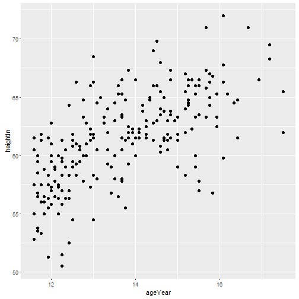
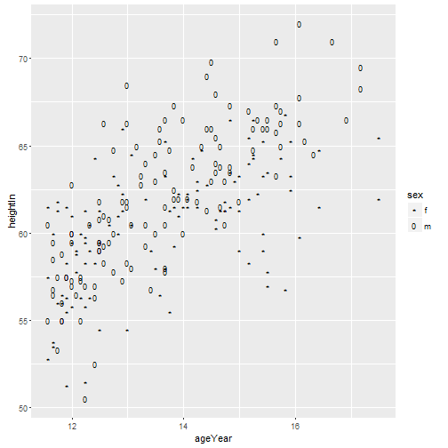
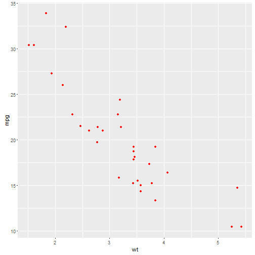
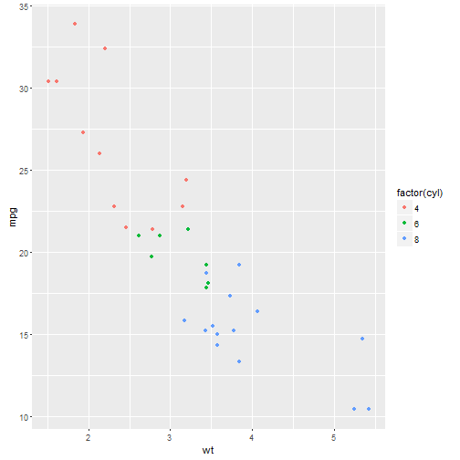

----

## Table of Contents

* Preface
1. R Basics
    - 1.1. Installing a Package 1
    - 1.2. Loading a Package 2
    - 1.3. Loading a Delimited Text Data File 3
    - 1.4. Loading Data from an Excel File 4
    - 1.5. Loading Data from an SPSS File 5
2. Quickly Exploring Data
    - 2.1. Creating a Scatter Plot 7
    - 2.2. Creating a Line Graph 9
    - 2.3. Creating a Bar Graph 11
    - 2.4. Creating a Histogram 13
    - 2.5. Creating a Box Plot 15
    - 2.6. Plotting a Function Curve 17
3. Bar Graphs
    - 3.1. Making a Basic Bar Graph 19
    - 3.2. Grouping Bars Together 22
    - 3.3. Making a Bar Graph of Counts 25
    - 3.4. Using Colors in a Bar Graph 27
    - 3.5. Coloring Negative and Positive Bars Differently 29
    - 3.6. Adjusting Bar Width and Spacing 30
    - 3.7. Making a Stacked Bar Graph 32
    - 3.8. Making a Proportional Stacked Bar Graph 35
    - 3.9. Adding Labels to a Bar Graph 38
    - 3.10. Making a Cleveland Dot Plot 42
4. Line Graphs
    - 4.1. Making a Basic Line Graph 49
    - 4.2. Adding Points to a Line Graph 52
    - 4.3. Making a Line Graph with Multiple Lines 53
    - 4.4. Changing the Appearance of Lines 58
    - 4.5. Changing the Appearance of Points 59
    - 4.6. Making a Graph with a Shaded Area 62
    - 4.7. Making a Stacked Area Graph 64
    - 4.8. Making a Proportional Stacked Area Graph 67
    - 4.9. Adding a Confidence Region 69
5. Scatter Plots
    - 5.1. Making a Basic Scatter Plot 73
    - 5.2. Grouping Data Points by a Variable Using Shape or Color 75
    - 5.3. Using Different Point Shapes 77
    - 5.4. Mapping a Continuous Variable to Color or Size 80
    - 5.5. Dealing with Overplotting 84
    - 5.6. Adding Fitted Regression Model Lines 89
    - 5.7. Adding Fitted Lines from an Existing Model 94
    - 5.8. Adding Fitted Lines from Multiple Existing Models 97
    - 5.9. Adding Annotations with Model Coefficients 100
    - 5.10. Adding Marginal Rugs to a Scatter Plot 103
    - 5.11. Labeling Points in a Scatter Plot 104
    - 5.12. Creating a Balloon Plot 110
    - 5.13. Making a Scatter Plot Matrix 112
6. Summarized Data Distributions
    - 6.1. Making a Basic Histogram 117
    - 6.2. Making Multiple Histograms from Grouped Data 120
    - 6.3. Making a Density Curve 123
    - 6.4. Making Multiple Density Curves from Grouped Data 126
    - 6.5. Making a Frequency Polygon 129
    - 6.6. Making a Basic Box Plot 130
    - 6.7. Adding Notches to a Box Plot 133
    - 6.8. Adding Means to a Box Plot 134
    - 6.9. Making a Violin Plot 135
    - 6.10. Making a Dot Plot 139
    - 6.11. Making Multiple Dot Plots for Grouped Data 141
    - 6.12. Making a Density Plot of Two-Dimensional Data 143
7. Annotations
    - 7.1. Adding Text Annotations 147
    - 7.2. Using Mathematical Expressions in Annotations 150
    - 7.3. Adding Lines 152
    - 7.4. Adding Line Segments and Arrows 155
    - 7.5. Adding a Shaded Rectangle 156
    - 7.6. Highlighting an Item 157
    - 7.7. Adding Error Bars 159
    - 7.8. Adding Annotations to Individual Facets 162
8. Axes
    - 8.1. Swapping X- and Y-Axes 167
    - 8.2. Setting the Range of a Continuous Axis 168
    - 8.3. Reversing a Continuous Axis 170
    - 8.4. Changing the Order of Items on a Categorical Axis 172
    - 8.5. Setting the Scaling Ratio of the X- and Y-Axes 174
    - 8.6. Setting the Positions of Tick Marks 177
    - 8.7. Removing Tick Marks and Labels 178
    - 8.8. Changing the Text of Tick Labels 180
    - 8.9. Changing the Appearance of Tick Labels 182
    - 8.10. Changing the Text of Axis Labels 184
    - 8.11. Removing Axis Labels 185
    - 8.12. Changing the Appearance of Axis Labels 187
    - 8.13. Showing Lines Along the Axes 189
    - 8.14. Using a Logarithmic Axis 190
    - 8.15. Adding Ticks for a Logarithmic Axis 196
    - 8.16. Making a Circular Graph 198
    - 8.17. Using Dates on an Axis 204
    - 8.18. Using Relative Times on an Axis 207
9. Controlling the Overall Appearance of Graphs
    - 9.1. Setting the Title of a Graph 211
    - 9.2. Changing the Appearance of Text 213
    - 9.3. Using Themes 216
    - 9.4. Changing the Appearance of Theme Elements 218
    - 9.5. Creating Your Own Themes 221
    - 9.6. Hiding Grid Lines 222
10. Legends
    - 10.1. Removing the Legend 225
    - 10.2. Changing the Position of a Legend 227
    - 10.3. Changing the Order of Items in a Legend 229
    - 10.4. Reversing the Order of Items in a Legend 231
    - 10.5. Changing a Legend Title 232
    - 10.6. Changing the Appearance of a Legend Title 235
    - 10.7. Removing a Legend Title 236
    - 10.8. Changing the Labels in a Legend 237
    - 10.9. Changing the Appearance of Legend Labels 239
    - 10.10. Using Labels with Multiple Lines of Text 240
11. Facets
    - 11.1. Splitting Data into Subplots with Facets 243
    - 11.2. Using Facets with Different Axes 246
    - 11.3. Changing the Text of Facet Labels 246
    - 11.4. Changing the Appearance of Facet Labels and Headers 250
12. Using Colors in Plots
    - 12.1. Setting the Colors of Objects 251
    - 12.2. Mapping Variables to Colors 252
    - 12.3. Using a Different Palette for a Discrete Variable 254
    - 12.4. Using a Manually Defined Palette for a Discrete Variable 259
    - 12.5. Using a Colorblind-Friendly Palette 261
    - 12.6. Using a Manually Defined Palette for a Continuous Variable 263
    - 12.7. Coloring a Shaded Region Based on Value 264
13. Miscellaneous Graphs
    - 13.1. Making a Correlation Matrix 267
    - 13.2. Plotting a Function 271
    - 13.3. Shading a Subregion Under a Function Curve 272
    - 13.4. Creating a Network Graph 274
    - 13.5. Using Text Labels in a Network Graph 278
    - 13.6. Creating a Heat Map 281
    - 13.7. Creating a Three-Dimensional Scatter Plot 283
    - 13.8. Adding a Prediction Surface to a Three-Dimensional Plot 285
    - 13.9. Saving a Three-Dimensional Plot 289
    - 13.10. Animating a Three-Dimensional Plot 291
    - 13.11. Creating a Dendrogram 291
    - 13.12. Creating a Vector Field 294
    - 13.13. Creating a QQ Plot 299
    - 13.14. Creating a Graph of an Empirical Cumulative Distribution Function 301
    - 13.15. Creating a Mosaic Plot 302
    - 13.16. Creating a Pie Chart 307
    - 13.17. Creating a Map 309
    - 13.18. Creating a Choropleth Map 313
    - 13.19. Making a Map with a Clean Background 317
    - 13.20. Creating a Map from a Shapefile 319
14. Output for Presentation
    - 14.1. Outputting to PDF Vector Files 323
    - 14.2. Outputting to SVG Vector Files 325
    - 14.3. Outputting to WMF Vector Files 325
    - 14.4. Editing a Vector Output File 326
    - 14.5. Outputting to Bitmap (PNG/TIFF) Files 327
    - 14.6. Using Fonts in PDF Files 330
    - 14.7. Using Fonts in Windows Bitmap or Screen Output 332
15. Getting Your Data into Shape
    - 15.1. Creating a Data Frame 336
    - 15.2. Getting Information About a Data Structure 337
    - 15.3. Adding a Column to a Data Frame 338
    - 15.4. Deleting a Column from a Data Frame 338
    - 15.5. Renaming Columns in a Data Frame 339
    - 15.6. Reordering Columns in a Data Frame 340
    - 15.7. Getting a Subset of a Data Frame 341
    - 15.8. Changing the Order of Factor Levels 343
    - 15.9. Changing the Order of Factor Levels Based on Data Values 344
    - 15.10. Changing the Names of Factor Levels 345
    - 15.11. Removing Unused Levels from a Factor 347
    - 15.12. Changing the Names of Items in a Character Vector 348
    - 15.13. Recoding a Categorical Variable to Another Categorical Variable 349
    - 15.14. Recoding a Continuous Variable to a Categorical Variable 351
    - 15.15. Transforming Variables 352
    - 15.16. Transforming Variables by Group 354
    - 15.17. Summarizing Data by Groups 357
    - 15.18. Summarizing Data with Standard Errors and Confidence Intervals 361
    - 15.19. Converting Data from Wide to Long 365
    - 15.20. Converting Data from Long to Wide 368
    - 15.21. Converting a Time Series Object to Times and Values 369
* A. Introduction to ggplot2
* Index

-----

## Requalied Packages


```r
library(ggplot2)
library(gcookbook)
library(plyr)
library(dplyr)
library(MASS)
```

----

## 1. R Basics


```r
## Read data
read.table()
read.csv()
library(xlsx)
read.xlsx()
library(gdata)
read.xls()
library(foreign)
read.spss()   # SPSS data
read.octave() # Matlab data
read.xport()  # SAS data
```


```r
ls("package:ggplot2")
```

```
##   [1] "%+%"                       "%+replace%"               
##   [3] "aes"                       "aes_"                     
##   [5] "aes_all"                   "aes_auto"                 
##   [7] "aes_q"                     "aes_string"               
##   [9] "alpha"                     "annotate"                 
##  [11] "annotation_custom"         "annotation_logticks"      
##  [13] "annotation_map"            "annotation_raster"        
##  [15] "arrow"                     "as_labeller"              
##  [17] "autoplot"                  "benchplot"                
##  [19] "borders"                   "calc_element"             
##  [21] "continuous_scale"          "Coord"                    
##  [23] "coord_cartesian"           "coord_equal"              
##  [25] "coord_fixed"               "coord_flip"               
##  [27] "coord_map"                 "coord_munch"              
##  [29] "coord_polar"               "coord_quickmap"           
##  [31] "coord_trans"               "CoordCartesian"           
##  [33] "CoordFixed"                "CoordFlip"                
##  [35] "CoordMap"                  "CoordPolar"               
##  [37] "CoordQuickmap"             "CoordTrans"               
##  [39] "cut_interval"              "cut_number"               
##  [41] "cut_width"                 "diamonds"                 
##  [43] "discrete_scale"            "draw_key_abline"          
##  [45] "draw_key_blank"            "draw_key_boxplot"         
##  [47] "draw_key_crossbar"         "draw_key_dotplot"         
##  [49] "draw_key_label"            "draw_key_path"            
##  [51] "draw_key_point"            "draw_key_pointrange"      
##  [53] "draw_key_polygon"          "draw_key_rect"            
##  [55] "draw_key_smooth"           "draw_key_text"            
##  [57] "draw_key_vline"            "draw_key_vpath"           
##  [59] "economics"                 "economics_long"           
##  [61] "element_blank"             "element_grob"             
##  [63] "element_line"              "element_rect"             
##  [65] "element_text"              "expand_limits"            
##  [67] "facet"                     "facet_grid"               
##  [69] "facet_null"                "facet_wrap"               
##  [71] "faithfuld"                 "fortify"                  
##  [73] "Geom"                      "geom_abline"              
##  [75] "geom_area"                 "geom_bar"                 
##  [77] "geom_bin2d"                "geom_blank"               
##  [79] "geom_boxplot"              "geom_contour"             
##  [81] "geom_count"                "geom_crossbar"            
##  [83] "geom_curve"                "geom_density"             
##  [85] "geom_density_2d"           "geom_density2d"           
##  [87] "geom_dotplot"              "geom_errorbar"            
##  [89] "geom_errorbarh"            "geom_freqpoly"            
##  [91] "geom_hex"                  "geom_histogram"           
##  [93] "geom_hline"                "geom_jitter"              
##  [95] "geom_label"                "geom_line"                
##  [97] "geom_linerange"            "geom_map"                 
##  [99] "geom_path"                 "geom_point"               
## [101] "geom_pointrange"           "geom_polygon"             
## [103] "geom_qq"                   "geom_quantile"            
## [105] "geom_raster"               "geom_rect"                
## [107] "geom_ribbon"               "geom_rug"                 
## [109] "geom_segment"              "geom_smooth"              
## [111] "geom_spoke"                "geom_step"                
## [113] "geom_text"                 "geom_tile"                
## [115] "geom_violin"               "geom_vline"               
## [117] "GeomAbline"                "GeomAnnotationMap"        
## [119] "GeomArea"                  "GeomBar"                  
## [121] "GeomBlank"                 "GeomBoxplot"              
## [123] "GeomContour"               "GeomCrossbar"             
## [125] "GeomCurve"                 "GeomCustomAnn"            
## [127] "GeomDensity"               "GeomDensity2d"            
## [129] "GeomDotplot"               "GeomErrorbar"             
## [131] "GeomErrorbarh"             "GeomHex"                  
## [133] "GeomHline"                 "GeomLabel"                
## [135] "GeomLine"                  "GeomLinerange"            
## [137] "GeomLogticks"              "GeomMap"                  
## [139] "GeomPath"                  "GeomPoint"                
## [141] "GeomPointrange"            "GeomPolygon"              
## [143] "GeomQuantile"              "GeomRaster"               
## [145] "GeomRasterAnn"             "GeomRect"                 
## [147] "GeomRibbon"                "GeomRug"                  
## [149] "GeomSegment"               "GeomSmooth"               
## [151] "GeomSpoke"                 "GeomStep"                 
## [153] "GeomText"                  "GeomTile"                 
## [155] "GeomViolin"                "GeomVline"                
## [157] "gg_dep"                    "ggplot"                   
## [159] "ggplot_build"              "ggplot_gtable"            
## [161] "ggplotGrob"                "ggproto"                  
## [163] "ggproto_parent"            "ggsave"                   
## [165] "ggtitle"                   "guide_colorbar"           
## [167] "guide_colourbar"           "guide_legend"             
## [169] "guides"                    "is.Coord"                 
## [171] "is.facet"                  "is.ggplot"                
## [173] "is.ggproto"                "is.theme"                 
## [175] "label_both"                "label_bquote"             
## [177] "label_context"             "label_parsed"             
## [179] "label_value"               "label_wrap_gen"           
## [181] "labeller"                  "labs"                     
## [183] "last_plot"                 "layer"                    
## [185] "layer_data"                "layer_grob"               
## [187] "layer_scales"              "lims"                     
## [189] "luv_colours"               "map_data"                 
## [191] "margin"                    "mean_cl_boot"             
## [193] "mean_cl_normal"            "mean_sdl"                 
## [195] "mean_se"                   "median_hilow"             
## [197] "midwest"                   "mpg"                      
## [199] "msleep"                    "Position"                 
## [201] "position_dodge"            "position_fill"            
## [203] "position_identity"         "position_jitter"          
## [205] "position_jitterdodge"      "position_nudge"           
## [207] "position_stack"            "PositionDodge"            
## [209] "PositionFill"              "PositionIdentity"         
## [211] "PositionJitter"            "PositionJitterdodge"      
## [213] "PositionNudge"             "PositionStack"            
## [215] "presidential"              "qplot"                    
## [217] "quickplot"                 "rel"                      
## [219] "remove_missing"            "resolution"               
## [221] "Scale"                     "scale_alpha"              
## [223] "scale_alpha_continuous"    "scale_alpha_discrete"     
## [225] "scale_alpha_identity"      "scale_alpha_manual"       
## [227] "scale_color_brewer"        "scale_color_continuous"   
## [229] "scale_color_discrete"      "scale_color_distiller"    
## [231] "scale_color_gradient"      "scale_color_gradient2"    
## [233] "scale_color_gradientn"     "scale_color_grey"         
## [235] "scale_color_hue"           "scale_color_identity"     
## [237] "scale_color_manual"        "scale_colour_brewer"      
## [239] "scale_colour_continuous"   "scale_colour_discrete"    
## [241] "scale_colour_distiller"    "scale_colour_gradient"    
## [243] "scale_colour_gradient2"    "scale_colour_gradientn"   
## [245] "scale_colour_grey"         "scale_colour_hue"         
## [247] "scale_colour_identity"     "scale_colour_manual"      
## [249] "scale_fill_brewer"         "scale_fill_continuous"    
## [251] "scale_fill_discrete"       "scale_fill_distiller"     
## [253] "scale_fill_gradient"       "scale_fill_gradient2"     
## [255] "scale_fill_gradientn"      "scale_fill_grey"          
## [257] "scale_fill_hue"            "scale_fill_identity"      
## [259] "scale_fill_manual"         "scale_linetype"           
## [261] "scale_linetype_continuous" "scale_linetype_discrete"  
## [263] "scale_linetype_identity"   "scale_linetype_manual"    
## [265] "scale_radius"              "scale_shape"              
## [267] "scale_shape_continuous"    "scale_shape_discrete"     
## [269] "scale_shape_identity"      "scale_shape_manual"       
## [271] "scale_size"                "scale_size_area"          
## [273] "scale_size_continuous"     "scale_size_discrete"      
## [275] "scale_size_identity"       "scale_size_manual"        
## [277] "scale_x_continuous"        "scale_x_date"             
## [279] "scale_x_datetime"          "scale_x_discrete"         
## [281] "scale_x_log10"             "scale_x_reverse"          
## [283] "scale_x_sqrt"              "scale_y_continuous"       
## [285] "scale_y_date"              "scale_y_datetime"         
## [287] "scale_y_discrete"          "scale_y_log10"            
## [289] "scale_y_reverse"           "scale_y_sqrt"             
## [291] "ScaleContinuous"           "ScaleContinuousDate"      
## [293] "ScaleContinuousDatetime"   "ScaleContinuousIdentity"  
## [295] "ScaleContinuousPosition"   "ScaleDiscrete"            
## [297] "ScaleDiscreteIdentity"     "ScaleDiscretePosition"    
## [299] "seals"                     "should_stop"              
## [301] "Stat"                      "stat_bin"                 
## [303] "stat_bin_2d"               "stat_bin_hex"             
## [305] "stat_bin2d"                "stat_binhex"              
## [307] "stat_boxplot"              "stat_contour"             
## [309] "stat_count"                "stat_density"             
## [311] "stat_density_2d"           "stat_density2d"           
## [313] "stat_ecdf"                 "stat_ellipse"             
## [315] "stat_function"             "stat_identity"            
## [317] "stat_qq"                   "stat_quantile"            
## [319] "stat_smooth"               "stat_spoke"               
## [321] "stat_sum"                  "stat_summary"             
## [323] "stat_summary_2d"           "stat_summary_bin"         
## [325] "stat_summary_hex"          "stat_summary2d"           
## [327] "stat_unique"               "stat_ydensity"            
## [329] "StatBin"                   "StatBin2d"                
## [331] "StatBindot"                "StatBinhex"               
## [333] "StatBoxplot"               "StatContour"              
## [335] "StatCount"                 "StatDensity"              
## [337] "StatDensity2d"             "StatEcdf"                 
## [339] "StatEllipse"               "StatFunction"             
## [341] "StatIdentity"              "StatQq"                   
## [343] "StatQuantile"              "StatSmooth"               
## [345] "StatSum"                   "StatSummary"              
## [347] "StatSummary2d"             "StatSummaryBin"           
## [349] "StatSummaryHex"            "StatUnique"               
## [351] "StatYdensity"              "theme"                    
## [353] "theme_bw"                  "theme_classic"            
## [355] "theme_dark"                "theme_get"                
## [357] "theme_gray"                "theme_grey"               
## [359] "theme_light"               "theme_linedraw"           
## [361] "theme_minimal"             "theme_set"                
## [363] "theme_update"              "theme_void"               
## [365] "transform_position"        "txhousing"                
## [367] "unit"                      "update_geom_defaults"     
## [369] "update_labels"             "update_stat_defaults"     
## [371] "waiver"                    "xlab"                     
## [373] "xlim"                      "ylab"                     
## [375] "ylim"                      "zeroGrob"
```

----

## 2. Quickly Exploring Data

### 2.1 Scatter Plot


```r
plot(mtcars$wt, mtcars$mpg)
```

 

```r
qplot(mtcars$wt, mtcars$mpg)
```

 

```r
qplot(wt, mpg, data = mtcars)
```

 

```r
ggplot(data = mtcars, aes(x = wt, y = mpg)) + geom_point()
```

 

### 2.2 Line Graph


```r
plot(pressure$temperature, pressure$pressure)
```

 

```r
plot(pressure$temperature, pressure$pressure, type = "l")
```

 


```r
plot(pressure$temperature, pressure$pressure, type = "l")
points(pressure$temperature, pressure$pressure)
```

 


```r
plot(pressure$temperature, pressure$pressure, type = "l")
points(pressure$temperature, pressure$pressure)
lines(pressure$temperature, pressure$pressure/2, col = "red")
points(pressure$temperature, pressure$pressure/2, col = "red")
```

 


```r
qplot(temperature, pressure, data = pressure, geom = "line")
```

 

```r
qplot(temperature, pressure, data = pressure, geom = c("line", "point"))
```

 

```r
ggplot(data = pressure, aes(x = temperature, y = pressure)) + 
    geom_line()
```

 

```r
ggplot(data = pressure, aes(x = temperature, y = pressure)) + 
    geom_line() + 
    geom_point()
```

 

### 2.3 Bar Graph


```r
BOD
```

```
##   Time demand
## 1    1    8.3
## 2    2   10.3
## 3    3   19.0
## 4    4   16.0
## 5    5   15.6
## 6    7   19.8
```

```r
barplot(BOD$demand)
```

 

```r
barplot(BOD$demand, names.arg = BOD$Time)
```

 


```r
barplot(mtcars$cyl)
```

 

```r
table(mtcars$cyl)
```

```
## 
##  4  6  8 
## 11  7 14
```

```r
barplot(table(mtcars$cyl))
```

 


```r
ggplot(data = BOD, aes(x = Time, y = demand)) + 
    geom_bar(stat = "identity")
```

 

```r
# Convert the x variable to a factor, so that it is treated as discrete
ggplot(data = BOD, aes(x = factor(Time), y = demand)) + 
    geom_bar(stat = "identity")
```

 


```r
qplot(cyl, data = mtcars)
```

```
## `stat_bin()` using `bins = 30`. Pick better value with `binwidth`.
```

 

```r
ggplot(mtcars, aes(x = cyl)) + geom_bar()
```

 

```r
qplot(factor(cyl), data = mtcars)
```

 

```r
ggplot(mtcars, aes(x = factor(cyl))) + geom_bar()
```

 

### 2.4 Histogram

#### view the distribution of one-dimensional data


```r
hist(mtcars$mpg)
```

 

```r
hist(mtcars$mpg, breaks = 10)
```

 


```r
qplot(mpg, data = mtcars)
```

```
## `stat_bin()` using `bins = 30`. Pick better value with `binwidth`.
```

 

```r
qplot(mpg, data = mtcars, binwidth = 4)
```

 

```r
ggplot(data = mtcars, aes(mpg)) + 
    geom_histogram(binwidth = 4)
```

 

### 2.5 Box Plot

#### comparing distributions


```r
head(ToothGrowth)
```

```
##    len supp dose
## 1  4.2   VC  0.5
## 2 11.5   VC  0.5
## 3  7.3   VC  0.5
## 4  5.8   VC  0.5
## 5  6.4   VC  0.5
## 6 10.0   VC  0.5
```

```r
plot(ToothGrowth$supp, ToothGrowth$len)
```

 


```r
boxplot(len ~ supp, data = ToothGrowth)
```

 


```r
boxplot(len ~ supp + dose, data = ToothGrowth)
```

 


```r
qplot(x = supp, y = len, data = ToothGrowth, geom = "boxplot")
```

 

```r
ggplot(data = ToothGrowth, aes(x = supp, y = len)) +
    geom_boxplot()
```

 

```r
qplot(x = interaction(supp, dose), y = len, 
      data = ToothGrowth, 
      geom = "boxplot")
```

 

```r
ggplot(data = ToothGrowth, aes(x = interaction(supp, dose), y = len)) + 
    geom_boxplot()
```

 

### 2.6 Function Curve


```r
curve(x^3 + 5*x, from = -4, to = 4)
```

 


```r
myfun <- function(xvar) {
    1/(1 + exp(-xvar + 10))
}
curve(myfun(x), from = 0, to = 20)
```

 


```r
curve(myfun(x), from = 0, to = 20)
curve(1-myfun(x), add = TRUE, col = "red")
```

 


```r
ggplot(data = data.frame(x = c(0, 20)), aes(x = x)) + 
    stat_function(fun = myfun, geom = "line")
```

 

----

## 3. Bar Graphs

----

## 5. Scatter Plots

> ### display the relationship between two continuous variables

### 5.1 Basic Scatter Plot


```r
head(heightweight)
```

```
##   sex ageYear ageMonth heightIn weightLb
## 1   f   11.92      143     56.3     85.0
## 2   f   12.92      155     62.3    105.0
## 3   f   12.75      153     63.3    108.0
## 4   f   13.42      161     59.0     92.0
## 5   f   15.92      191     62.5    112.5
## 6   f   14.25      171     62.5    112.0
```

```r
head(heightweight[, c("ageYear", "heightIn")])
```

```
##   ageYear heightIn
## 1   11.92     56.3
## 2   12.92     62.3
## 3   12.75     63.3
## 4   13.42     59.0
## 5   15.92     62.5
## 6   14.25     62.5
```


```r
ggplot(data = heightweight, aes(x = ageYear, y = heightIn)) + 
    geom_point()
```

 

```r
ggplot(data = heightweight, aes(x = ageYear, y = heightIn)) +
    geom_point(shape = 16)
```

 

```r
ggplot(data = heightweight, aes(x = ageYear, y = heightIn)) +
    geom_point(shape = 19)
```

 

```r
ggplot(data = heightweight, aes(x = ageYear, y = heightIn)) +
    geom_point(shape = 21)
```

 

```r
ggplot(data = heightweight, aes(x = ageYear, y = heightIn)) +
    geom_point(size = 2)
```

 

### 5.2 Grouping Data Points by a Variable Using Shape or Color


```r
head(heightweight[, c("sex", "ageYear", "heightIn")])
```

```
##   sex ageYear heightIn
## 1   f   11.92     56.3
## 2   f   12.92     62.3
## 3   f   12.75     63.3
## 4   f   13.42     59.0
## 5   f   15.92     62.5
## 6   f   14.25     62.5
```

```r
ggplot(data = heightweight, aes(x = ageYear, y = heightIn, colour = sex)) +
    geom_point()
```

 

```r
ggplot(data = heightweight, aes(x = ageYear, y = heightIn, shape = sex)) + 
    geom_point()
```

 


```r
ggplot(data = heightweight, aes(x = ageYear, y = heightIn, shape = sex, colour = sex)) + 
    geom_point()
```

 

```r
ggplot(data = heightweight, aes(x = ageYear, y = heightIn, shape = sex, colour = sex)) +
    geom_point() + 
    scale_shape_manual(values = c(1, 2)) + 
    scale_colour_brewer(palette = "Set1")
```

 

```r
##  scale_colour_manual()
```


### 5.3 Using Different Point Shapes

#### Point Shapes


```r
ggplot(data = heightweight, aes(x = ageYear, y = heightIn)) + 
    geom_point(shape = 3)
```

 

```r
ggplot(heightweight, aes(x = ageYear, y = heightIn, shape = sex)) +
    geom_point(size = 3) + 
    scale_shape_manual(values = c("*", "0"))
```

 

```r
# Make a copy of the data
hw <- heightweight
# Categorize into <100 and >=100 groups
hw$weightGroup <- cut(hw$weightLb,
                      breaks = c(-Inf, 100, Inf), 
                      labels = c("< 100", ">= 100"))
# Use shapes with fill and color, and use colors that are empty (NA) and filled
ggplot(hw, aes(x = ageYear, y = heightIn, shape = sex, fill = weightGroup)) + 
    geom_point(size = 2.5) + 
    scale_shape_manual(values = c(21, 24)) + 
    scale_fill_manual(values = c(NA, "black"), 
                      guide = guide_legend(override.aes = list(shape = 21)))
```

 


### 5.4 Mapping a Continuous Variable to Color or Size


```r
ggplot(data = heightweight, aes(x = ageYear, y = heightIn, colour = weightLb)) + 
    geom_point()
```

 

```r
ggplot(data = heightweight, aes(x = ageYear, y = heightIn, size = weightLb)) + 
    geom_point()
```

 

```r
ggplot(data = heightweight, aes(x = ageYear, y = heightIn, size = weightLb)) + 
    geom_point() +
    scale_size_continuous(range=c(2, 5))
```

 

```r
ggplot(heightweight, aes(x = weightLb, y = heightIn, fill = ageYear)) + 
    geom_point(shape = 21, size = 2.5) +
    scale_fill_gradient(low = "black", high = "white")
```

 

```r
# Using guide_legend() will result in a discrete legend instead of a colorbar
ggplot(heightweight, aes(x = weightLb, y = heightIn, fill = ageYear)) + 
    geom_point(shape = 21, size = 2.5) + 
    scale_fill_gradient(low = "black", high = "white", breaks = 12:17, guide = guide_legend())
```

 


```r
ggplot(heightweight, aes(x=ageYear, y=heightIn, size=weightLb, colour=sex)) +
geom_point(alpha=.5) +
scale_size_area() + # Make area proportional to numeric value
scale_colour_brewer(palette="Set1")
```

 


### 5.5 Dealing with Overplotting


----

## 11. Facets

> ### Rendering groups of data alongside each other, making it easy to compare the groups
> ### Create a subplot for each group and draw the subplots side by side

`Main Function:`

* facet_grid()
* facet_wrap()

### 11.1 Splitting Data into Subplots with Facets


```r
head(mpg)
```

```
## Source: local data frame [6 x 11]
## 
##   manufacturer model displ year cyl      trans drv cty hwy fl   class
## 1         audi    a4   1.8 1999   4   auto(l5)   f  18  29  p compact
## 2         audi    a4   1.8 1999   4 manual(m5)   f  21  29  p compact
## 3         audi    a4   2.0 2008   4 manual(m6)   f  20  31  p compact
## 4         audi    a4   2.0 2008   4   auto(av)   f  21  30  p compact
## 5         audi    a4   2.8 1999   6   auto(l5)   f  16  26  p compact
## 6         audi    a4   2.8 1999   6 manual(m5)   f  18  26  p compact
```


```r
# The base plot
p = ggplot(mpg, aes(x = displ, y = hwy)) + 
    geom_point()
p
```

 

```r
# Faceted by drv, in vertically arranged subpanels
p + facet_grid(drv ~ .)
```

 

```r
# Faceted by cyl, in horizontally arranged subpanels
p + facet_grid(. ~ cyl)
```

 

```r
# Split by drv (vertical) and cyl (horizontal)
p + facet_grid(drv ~ cyl)
```

 

----


```r
# Facet on class
# Note there is nothing before the tilde
p + facet_wrap( ~ class)
```

 


```r
# These will have the same result: 2 rows and 4 cols
p + facet_wrap( ~ class, nrow=2)
```

 

```r
p + facet_wrap( ~ class, ncol=4)
```

 


### 11.2 Using Facets with Different Axes


```r
# The base plot
p = ggplot(mpg, aes(x = displ, y = hwy)) +
    geom_point()
p
```

 

```r
# With free x scales
p + facet_grid(drv ~ cyl, scales = "free_x")
```

 

```r
# With free y scales
p + facet_grid(drv ~ cyl, scales = "free_y")
```

 

```r
# With free x and y scales
p + facet_grid(drv ~ cyl, scales = "free")
```

 


### 11.3 Changing the Text of Facet Labels


```r
mpg2 <- mpg # Make a copy of the original data
# Rename 4 to 4wd, f to Front, r to Rear
levels(mpg2$drv)[levels(mpg2$drv)=="4"] <- "4wd"
levels(mpg2$drv)[levels(mpg2$drv)=="f"] <- "Front"
levels(mpg2$drv)[levels(mpg2$drv)=="r"] <- "Rear"
# Plot the new data
ggplot(mpg2, aes(x = displ, y = hwy)) + 
    geom_point() + 
    facet_grid(drv ~ .)
```

 


```r
ggplot(mpg2, aes(x = displ, y = hwy)) + 
    geom_point() +
    facet_grid(drv ~ ., labeller = label_both)
```

 

```r
mpg3 <- mpg
levels(mpg3$drv)[levels(mpg3$drv)=="4"] <- "4^{wd}"
levels(mpg3$drv)[levels(mpg3$drv)=="f"] <- "- Front %.% e^{pi * i}"
levels(mpg3$drv)[levels(mpg3$drv)=="r"] <- "4^{wd} - Front"
ggplot(mpg3, aes(x = displ, y = hwy)) + 
    geom_point() + 
    facet_grid(drv ~ ., labeller = label_parsed)
```

 


### 11.4 Changing the Appearance of Facet Labels and Headers


```r
head(cabbage_exp)
```

```
##   Cultivar Date Weight        sd  n         se
## 1      c39  d16   3.18 0.9566144 10 0.30250803
## 2      c39  d20   2.80 0.2788867 10 0.08819171
## 3      c39  d21   2.74 0.9834181 10 0.31098410
## 4      c52  d16   2.26 0.4452215 10 0.14079141
## 5      c52  d20   3.11 0.7908505 10 0.25008887
## 6      c52  d21   1.47 0.2110819 10 0.06674995
```


```r
ggplot(cabbage_exp, aes(x = Cultivar, y = Weight)) + 
    geom_bar(stat = "identity") +
    facet_grid(. ~ Date)
```

 


```r
ggplot(cabbage_exp, aes(x = Cultivar, y = Weight)) + 
    geom_bar(stat = "identity") +
    facet_grid(. ~ Date) +
    theme(strip.text = element_text(face = "bold", size = rel(1.5)),
          strip.background = element_rect(fill = "lightblue", colour = "black", size = 1))
```

 

----

## 12. Using Colors in Plots

### 12.1 Setting the Colors of Objects

> `colour` controls the color of lines and of the outlines of polygons

> `fill` controls the color of the fill area of polygons

> `point shapes` are sometimes a little different. For most point shapes, the color of the entire point is controlled by colour, not fill. The exception is the point shapes (21–25) that have both a fill and an outline.


```r
ggplot(data = mtcars, mapping = aes(x = wt, y = mpg)) + 
    geom_point(colour = "red")
```

 

```r
ggplot(data = mtcars, mapping = aes(x = wt, y = mpg)) + 
    geom_point(colour = "red", shape = 3)
```

 

```r
ggplot(data = mtcars, mapping = aes(x = wt, y = mpg)) + 
    geom_point(fill = "red", colour = "black", shape = 21)
```

 

```r
ggplot(data = mtcars, mapping = aes(x = wt, y = mpg)) + 
    geom_point(fill = "red", colour = "black", shape = 22)
```

 

```r
ggplot(data = mtcars, mapping = aes(x = wt, y = mpg)) + 
    geom_point(fill = "red", colour = "black", shape = 23)
```

 

```r
ggplot(data = mtcars, mapping = aes(x = wt, y = mpg)) + 
    geom_point(fill = "red", colour = "black", shape = 24)
```

 

```r
ggplot(data = mtcars, mapping = aes(x = wt, y = mpg)) + 
    geom_point(fill = "red", colour = "black", shape = 25)
```

 

```r
ggplot(data = birthwt, mapping = aes(x = bwt)) + 
    geom_histogram(fill = "red", colour = "black")
```

```
## `stat_bin()` using `bins = 30`. Pick better value with `binwidth`.
```

 

## 12.2 Mapping Variables to Colors

> Use a variable (column from a data frame) to control the color of geoms

> In the call to the geom, set the value of colour or fill to the name of one of the columns in the data


```r
head(cabbage_exp)
```

```
##   Cultivar Date Weight        sd  n         se
## 1      c39  d16   3.18 0.9566144 10 0.30250803
## 2      c39  d20   2.80 0.2788867 10 0.08819171
## 3      c39  d21   2.74 0.9834181 10 0.31098410
## 4      c52  d16   2.26 0.4452215 10 0.14079141
## 5      c52  d20   3.11 0.7908505 10 0.25008887
## 6      c52  d21   1.47 0.2110819 10 0.06674995
```

# ???


```r
# These both have the same effect
ggplot(cabbage_exp, aes(x = Date, y = Weight, fill = Cultivar)) + 
    geom_bar(colour = "black", position = "dodge")
ggplot(cabbage_exp, aes(x = Date, y = Weight)) + 
    geom_bar(aes(fill = Cultivar), colour = "black", position = "dodge")
```


```r
# These both have the same effect
ggplot(mtcars, aes(x = wt, y = mpg, colour = cyl)) + 
    geom_point()
```

 

```r
ggplot(mtcars, aes(x = wt, y = mpg)) + 
    geom_point(aes(colour = cyl))
```

 


```r
# Convert to factor in call to ggplot()
ggplot(mtcars, aes(x = wt, y = mpg, colour = factor(cyl))) + 
    geom_point()
```

 

```r
# Another method: Convert to factor in the data
m = mtcars
m$cyl = factor(m$cyl)
ggplot(m, aes(x = wt, y = mpg, colour = cyl)) + 
    geom_point()
```

 


## 12.3 Using a Different Palette for a Discrete Variable

### 1. Discrete fill and color scales

Fill scale            | Color scale              | Description
--------------------- | ------------------------ | ---------------------------------------------------
scale_fill_discrete() | scale_colour_discrete()  | Colors evenly spaced around the color wheel (same as hue)
scale_fill_hue()      | scale_colour_hue()       | Colors evenly spaced around the color wheel (same as discrete)
scale_fill_grey()     | scale_colour_grey()      | Greyscale palette
scale_fill_brewer()   | scale_colour_brewer()    | ColorBrewer palettes
scale_fill_manual()   | scale_colour_manual()    | Manually specified colors

> hue() : HCL (hue-chroma-lightness) color space, the default lightness value is 65 on a scale from 0–100.This is good for filled areas, but it’s a bit light for points and lines. 

### 2. Default palette

#### Data


```r
head(uspopage)
```

```
##   Year AgeGroup Thousands
## 1 1900       <5      9181
## 2 1900     5-14     16966
## 3 1900    15-24     14951
## 4 1900    25-34     12161
## 5 1900    35-44      9273
## 6 1900    45-54      6437
```

#### Base plot


```r
p = ggplot(uspopage, aes(x = Year, y = Thousands, fill = AgeGroup)) + 
    geom_area()
```

#### These three have the same effect


```r
p
```

 

```r
p + scale_fill_discrete()
```

 

```r
p + scale_fill_hue()
```

 

#### For points and lines. To make the colors darker for points and lines, set the value of l=45 (luminance/lightness):


```r
# Basic scatter plot
h = ggplot(heightweight, aes(x = ageYear, y = heightIn, colour = sex)) + 
    geom_point()
# Default lightness = 65
h
```

 

```r
# Slightly darker
h + scale_colour_hue(l = 45)
```

 

### 3. ColorBrewer palette (For more about ColorBrewer, see [here](http://colorbrewer.org))

#### All the ColorBrewer palettes


```r
library(RColorBrewer)
display.brewer.all()
```


```r
p + scale_fill_brewer()
```

 


```r
p + scale_fill_brewer(palette="Oranges")
```

 


```r
p + scale_fill_brewer(palette="BuPu")
```

 

### 4. Palette of greys. This is useful for print when the output is in black and white. The default is to start at 0.2 and end at 0.8, on a scale from 0 (black) to 1 (white), but you can change the range :


```r
p + scale_fill_grey()
```

 

```r
# Reverse the direction and use a different range of greys
p + scale_fill_grey(start = 0.7, end = 0)
```

 


```r
p + scale_fill_manual()
```

## 12.4 Using a Manually Defined Palette for a Discrete Variable


----


## 13. Miscellaneous Graphs


### 13.1 Making a Correlation Matrix

> graphical correlation matrix

#### Data


```r
head(mtcars)
```

```
##                    mpg cyl disp  hp drat    wt  qsec vs am gear carb
## Mazda RX4         21.0   6  160 110 3.90 2.620 16.46  0  1    4    4
## Mazda RX4 Wag     21.0   6  160 110 3.90 2.875 17.02  0  1    4    4
## Datsun 710        22.8   4  108  93 3.85 2.320 18.61  1  1    4    1
## Hornet 4 Drive    21.4   6  258 110 3.08 3.215 19.44  1  0    3    1
## Hornet Sportabout 18.7   8  360 175 3.15 3.440 17.02  0  0    3    2
## Valiant           18.1   6  225 105 2.76 3.460 20.22  1  0    3    1
```

#### Numerical Correlation Matrix 

> If there are any columns that you don’t want used for correlations (for example, a column of names), you should exclude them. 

> If there are any NA cells in the original data, the resulting correlation matrix will have NA values. To deal with this, you will probably want to use the option `use = "complete.obs"` or `use = "pairwise.complete.obs"`.


```r
mcor <- cor(mtcars)
round(mcor, digits=2)
```

```
##        mpg   cyl  disp    hp  drat    wt  qsec    vs    am  gear  carb
## mpg   1.00 -0.85 -0.85 -0.78  0.68 -0.87  0.42  0.66  0.60  0.48 -0.55
## cyl  -0.85  1.00  0.90  0.83 -0.70  0.78 -0.59 -0.81 -0.52 -0.49  0.53
## disp -0.85  0.90  1.00  0.79 -0.71  0.89 -0.43 -0.71 -0.59 -0.56  0.39
## hp   -0.78  0.83  0.79  1.00 -0.45  0.66 -0.71 -0.72 -0.24 -0.13  0.75
## drat  0.68 -0.70 -0.71 -0.45  1.00 -0.71  0.09  0.44  0.71  0.70 -0.09
## wt   -0.87  0.78  0.89  0.66 -0.71  1.00 -0.17 -0.55 -0.69 -0.58  0.43
## qsec  0.42 -0.59 -0.43 -0.71  0.09 -0.17  1.00  0.74 -0.23 -0.21 -0.66
## vs    0.66 -0.81 -0.71 -0.72  0.44 -0.55  0.74  1.00  0.17  0.21 -0.57
## am    0.60 -0.52 -0.59 -0.24  0.71 -0.69 -0.23  0.17  1.00  0.79  0.06
## gear  0.48 -0.49 -0.56 -0.13  0.70 -0.58 -0.21  0.21  0.79  1.00  0.27
## carb -0.55  0.53  0.39  0.75 -0.09  0.43 -0.66 -0.57  0.06  0.27  1.00
```


```r
library(corrplot)
corrplot(mcor)
```

 


```r
corrplot(mcor, method = "shade", shade.col = NA, tl.col = "black", tl.srt = 45)
```

 


```r
# Generate a lighter palette
col <- colorRampPalette(c("#BB4444", "#EE9988", "#FFFFFF", "#77AADD", "#4477AA"))
corrplot(mcor, 
         method = "shade", 
         shade.col = NA, 
         tl.col = "black", 
         tl.srt = 45, 
         col = col(200), 
         addCoef.col = "black", 
         addcolorlabel = "no", 
         order = "AOE")
```

 


```r
?corrplot()
```

### 13.2 Plotting a Function


```r
# The data frame is only used for setting the range
p = ggplot(data.frame(x = c(-3,3)), aes(x = x))
p + stat_function(fun = dnorm)
```

 

```r
p + stat_function(fun = dt, args = list(df = 2))
```

 


```r
myfun = function(xvar) {
    1/(1 + exp(-xvar + 10))
}
ggplot(data.frame(x = c(0, 20)), aes(x = x)) + 
    stat_function(fun = myfun)
```

 


#### To smooth out the curve, pass a larger value of n to `stat_function()`


```r
ggplot(data.frame(x = c(0, 20)), aes(x = x)) + 
    stat_function(fun = myfun, n = 200)
```

 

### 13.3 Shading a Subregion Under a Function Curve


```r
# Return dnorm(x) for 0 < x < 2, and NA for all other x
dnorm_limit <- function(x) {
    y <- dnorm(x) 
    y[x < 0 | x > 2] <- NA
    return(y)
}
# ggplot() with dummy data
p = ggplot(data.frame(x = c(-3, 3)), aes(x = x))
p + 
    stat_function(fun = dnorm_limit, geom = "area", fill = "blue", alpha = 0.2) + 
    stat_function(fun = dnorm)
```

```
## Warning: Removed 67 rows containing missing values (geom_area).
```

 

## 13.4 Creating a Network Graph


```r
library(igraph)
```


```r
# Specify edges for a directed graph
gd = graph(c(1,2, 2,3, 2,4, 1,4, 5,5, 3,6))
gd
```

```
## IGRAPH D--- 6 6 -- 
## + edges:
## [1] 1->2 2->3 2->4 1->4 5->5 3->6
```

```r
plot(gd)
```

 


```r
# For an undirected graph, No labels
gu = graph(c(1,2, 2,3, 2,4, 1,4, 5,5, 3,6), directed = FALSE)
gu
```

```
## IGRAPH U--- 6 6 -- 
## + edges:
## [1] 1--2 2--3 2--4 1--4 5--5 3--6
```

```r
plot(gu, vertex.label = NA)
```

 


```r
str(gd)
```

```
## IGRAPH D--- 6 6 -- 
## + edges:
## [1] 1->2 2->3 2->4 1->4 5->5 3->6
```

```r
str(gu)
```

```
## IGRAPH U--- 6 6 -- 
## + edges:
## [1] 1--2 2--3 2--4 1--4 5--5 3--6
```


